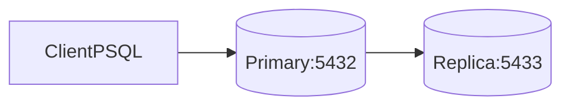

# DB Replication Lab (Primary/Replica)

## Overview
This lab demonstrates physical replication with PostgreSQL primary and replica
nodes using Docker Compose and Bitnami PostgreSQL images.

## Architecture


## Prerequisites
- Docker and Docker Compose
- `psql` client

## Quick Start
```bash
docker-compose up -d
```
Set `PGPASSWORD=demo_admin_password_change_me` before running `psql` commands.

## How to Verify
1. Connect to primary:
   ```bash
   psql -h localhost -p 5432 -U admin -d app_db
   ```
2. Connect to replica:
   ```bash
   psql -h localhost -p 5433 -U admin -d app_db
   ```
3. On primary, create and write a test table/row.
4. On replica, verify replicated data appears.

## Failure Scenarios to Try
- Stop primary and test read behavior on replica.
- Restart primary and observe replication continuity.

## Trade-offs and Design Notes
- Primary/replica setup helps when read traffic grows, because read queries can
  be moved to replicas instead of overloading the write node.
- Writes still go to the primary, so write throughput and write availability
  remain tied to that node.
- Replication adds operational concerns (lag, failover procedure, role changes)
  that are easy to underestimate when the topology first looks simple.

## Observability
- `docker-compose logs primary replica`
- PostgreSQL replication status queries from primary.

## Experiments
- **Hypothesis**: replica reflects primary writes with small delay.
- **Method**: insert timed records and compare visibility timestamps.
- **Result**: data appears on replica after propagation delay.
- **Interpretation**: replication lag is non-zero and workload dependent.

## Jargon Explained
- **Primary**: node that accepts writes and produces replication stream.
- **Replica**: node that replays primary changes, typically used for reads.
- **Replication lag**: time gap between primary commit and replica visibility.
- **Failover**: promoting a replica to primary after primary failure.

## Lessons Learned
- Seeing data appear on the replica after a short delay made lag feel real, not
  just theoretical. Even small lag can matter for user-facing read-after-write
  expectations.
- I learned that "replication configured" is not the same as "high
  availability solved." You still need a clear failover and client rerouting
  plan.
- The practical design question became: which reads can tolerate stale data,
  and which ones must stay on primary.

## Cleanup
```bash
docker-compose down -v
```

## Further Reading
- PostgreSQL replication concepts
