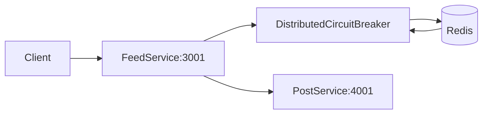

# Distributed Circuit Breaker Lab

## Overview
This lab demonstrates a Redis-coordinated distributed circuit breaker. A feed
service calls a flaky downstream post service and uses shared breaker state to
fail fast during instability.

## Architecture


## Prerequisites
- Docker and Docker Compose

## Quick Start
```bash
docker-compose up --build
```

## How to Verify
1. Call feed endpoint repeatedly:
   ```bash
   curl -i http://localhost:3001/api/feed
   ```
2. Crash downstream service:
   ```bash
   curl -X POST http://localhost:4001/admin/crash
   ```
3. Call feed again and expect graceful fallback:
   ```bash
   curl -i http://localhost:3001/api/feed
   ```
   Expect `503` with fallback message when breaker is open.
4. Recover downstream:
   ```bash
   curl -X POST http://localhost:4001/admin/recover
   ```
   After reset timeout, circuit should transition toward recovery.

## Failure Scenarios to Try
- Keep hitting `/api/feed` during crash window and observe fast-fail behavior.
- Compare behavior before and after reset timeout (`HALF_OPEN` transition).

## Trade-offs and Design Notes
- Shared state in Redis means all API instances can agree on breaker state
  (`CLOSED`, `OPEN`, `HALF_OPEN`) instead of each instance guessing on its own.
- Fast-fail (returning quickly when breaker is open) protects the downstream
  service from being hammered, but users may see more temporary `503` responses.
- `HALF_OPEN` is a cautious recovery mode: let one request test health first,
  then reopen traffic if successful. This avoids a recovery-time traffic spike.

## Observability
- Watch app logs for breaker states (`OPEN`, `HALF_OPEN`, `CLOSED`).
- Watch Redis pub/sub events for state broadcasts.

## Experiments
- **Hypothesis**: global breaker coordination reduces cascading failures.
- **Method**: induce repeated downstream failures and measure fallback rate.
- **Result**: once threshold is crossed, requests fail fast with fallback.
- **Interpretation**: fast-fail preserves system responsiveness under failure.

## Jargon Explained
- **Circuit breaker**: a guard in front of a failing dependency that stops
  repeated calls once failures cross a threshold.
- **Fail fast**: return an error quickly instead of waiting on slow timeouts.
- **Cascading failure**: one dependency failure causes retries/timeouts that
  degrade other services too.
- **Half-open**: a temporary probe state where limited traffic is allowed to
  test whether the dependency has recovered.

## Lessons Learned
- The practical win was not "no errors"; it was controlled errors. Returning a
  quick fallback was much better than letting request threads pile up waiting.
- I learned that local-only breaker state is misleading in multi-instance apps.
  Without shared state, one instance can be open while another keeps flooding
  the same unhealthy dependency.
- Recovery behavior matters as much as trip behavior. The half-open probe phase
  prevented a "recovery stampede" when the downstream came back.

## Cleanup
```bash
docker-compose down
```

## Further Reading
- Circuit Breaker pattern (resilience engineering)
