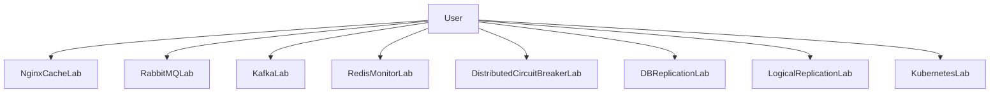

# Architecture Overview

This monorepo contains independent labs, each demonstrating one system design
concept in isolation.

## Concept to Lab Mapping
- Caching and reverse proxy: `nginx-cache-lab`
- Work queues and at-least-once processing patterns: `queue`
- Event streaming and consumer groups: `kafka`
- Pub/sub observability fan-out: `redis-monitor`
- Resiliency and graceful degradation: `distributed-cb-lab`
- Primary-replica physical replication: `db-replication-lab`
- Publication/subscription logical replication: `logical-replication-lab`
- Cluster deployment fundamentals: `kube`

## Cross-Lab Design Themes
- Favor small, focused services per experiment.
- Keep one core concept per lab to reduce noise.
- Document not only setup, but failure behavior and trade-offs.
- Prefer reproducible commands with explicit expected outcomes.
