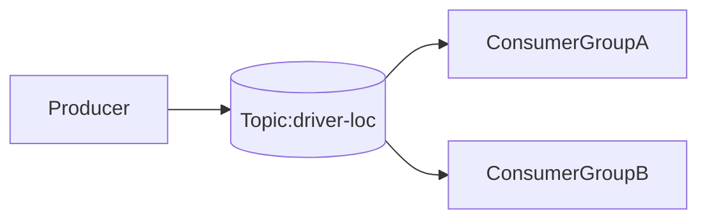

# Kafka Lab

## Overview
This lab demonstrates Kafka (message streams) producer/consumer basics, topic appends, and
consumer-group behavior using `kafkajs`.

## Architecture


## Prerequisites
- Node.js 18+ and npm
- Running Kafka broker reachable at `localhost:9092`

## Quick Start
```bash
npm install
node consumer.js billing-service
```
In another terminal:
```bash
node producer.js
```

## How to Verify
- Consumer should print incoming GPS events.
- Run consumer with a different group name to compare offset behavior:
  ```bash
  node consumer.js analytics-service
  ```

## Failure Scenarios to Try
- Stop broker and run producer to observe connection failures.
- Restart consumer with same vs new group ID and compare replay behavior.

## Trade-offs and Design Notes
- Kafka keeps events in an append-only log, so consumers can read now and also
  replay later from stored offsets when debugging or rebuilding state.
- Consumer groups scale processing horizontally: each partition is consumed by
  only one consumer in a group at a time.
- Offset tracking is the practical sharp edge. If offsets are handled poorly,
  you can skip events or process duplicates.

## Observability
- Producer/consumer console logs.
- Broker metrics if running local UI/monitoring tools.

## Optional Kafka UI (Highly Recommended)
Kafka does not ship with a built-in web UI like RabbitMQ management.

If you hit the broker port (`9092`) in a browser, it sends an HTTP `GET` to a
non-HTTP Kafka protocol port, so you will see confusing protocol errors in
broker logs.

Use `kafka-ui` instead:

```bash
docker run --rm -p 8081:8080 \
  -e KAFKA_CLUSTERS_0_NAME=local \
  -e KAFKA_CLUSTERS_0_BOOTSTRAPSERVERS=host.docker.internal:9092 \
  provectuslabs/kafka-ui:latest
```

Podman users on Linux usually need:
- `host.containers.internal:9092` instead of `host.docker.internal:9092`

Open `http://localhost:8081` to inspect topics, partitions, and messages.

## Experiments
- **Hypothesis**: new consumer group can read independent offsets.
- **Method**: run producer, then launch consumers with different group IDs.
- **Result**: each group tracks its own progress.
- **Interpretation**: consumer-group identity controls processing semantics.

## Jargon Explained
- **Topic**: named stream of events (like a durable event log).
- **Partition**: ordered shard of a topic used for parallelism.
- **Offset**: numeric position of a message in a partition.
- **Consumer group**: cooperating consumers sharing work from a topic.
- **Replay**: reading older messages again from a chosen offset.

## Lessons Learned
- Running the same consumer with different group IDs made the model concrete:
  group identity is not just naming, it changes who owns progress.
- I learned quickly that retries without idempotency are risky. In stream
  systems, duplicates are normal enough that handlers should be safe to run
  more than once.
- Good Kafka design starts with event ownership and recovery strategy, not only
  producer code.

## Cleanup
Stop running consumer/producer processes.

## Further Reading
- Kafka consumer groups and offset management
- [kafka-ui](https://github.com/provectus/kafka-ui)
