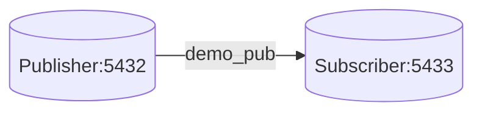

# Logical Replication Lab (Publication/Subscription)

## Overview
This lab demonstrates PostgreSQL logical replication with a publisher and
subscriber setup. Replication is configured manually to learn publication and
subscription workflow.

## Architecture


## Prerequisites
- Docker and Docker Compose
- `psql` client

## Quick Start
```bash
docker-compose up -d
```
Set `PGPASSWORD=demo_password_change_me` before running `psql` commands.

## How to Verify
1. Connect to publisher:
   ```bash
   psql -h localhost -p 5432 -U admin -d demo_db
   ```
2. Create publication if needed:
   ```sql
   CREATE PUBLICATION demo_pub FOR TABLE users;
   ```
3. Connect to subscriber:
   ```bash
   psql -h localhost -p 5433 -U admin -d demo_db
   ```
4. Create subscription:
   ```sql
   CREATE SUBSCRIPTION demo_sub
   CONNECTION 'host=publisher port=5432 user=admin dbname=demo_db'
   PUBLICATION demo_pub;
   ```
5. Insert new rows on publisher, then confirm on subscriber.

## Failure Scenarios to Try
- Stop publisher and observe subscriber behavior.
- Drop/recreate subscription and compare sync behavior.

## Trade-offs and Design Notes
- Logical replication lets you choose exactly which tables/publications to
  replicate, which is useful for migrations and selective data movement.
- That flexibility comes with more setup steps than physical replication:
  schema alignment, publication/subscription creation, and ownership checks.
- This model is strong for controlled replication between systems, but it needs
  careful operational runbooks when subscriptions fail or drift.

## Observability
- Check subscription status views on subscriber.
- Track lag and apply errors in logs.

## Experiments
- **Hypothesis**: only published tables replicate.
- **Method**: publish one table, change another, observe subscriber.
- **Result**: only published table updates propagate.
- **Interpretation**: logical replication offers fine-grained control.

## Jargon Explained
- **Publication**: list of tables/changes exposed by the publisher.
- **Subscription**: subscriber-side object that pulls changes from a
  publication.
- **Schema compatibility**: table structure and types must align enough for
  change application to succeed.
- **Initial sync**: first copy phase before ongoing change streaming.

## Lessons Learned
- The manual setup order mattered more than I expected. Creating objects in the
  wrong sequence produced errors that looked unrelated until I retraced steps.
- Logical replication felt best when I wanted targeted movement of data, not a
  full database clone.
- The main operational insight was to treat schema changes carefully: publisher
  and subscriber must evolve in a compatible way, or replication can stall.

## Cleanup
```bash
docker-compose down -v
```

## Further Reading
- PostgreSQL logical replication docs
