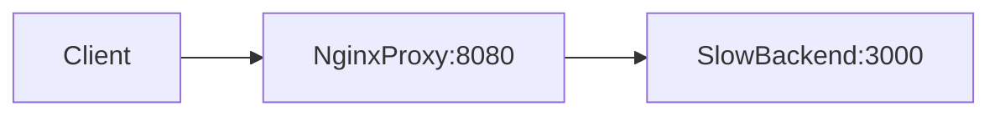

# Nginx Cache Lab

## Overview
This lab demonstrates reverse-proxy caching behavior with Nginx in front of a
slow backend API. You can observe `MISS`, `HIT`, and `BYPASS` behavior and how
caching reduces repeated response latency.

## Architecture


## Prerequisites
- Docker and Docker Compose

## Quick Start
```bash
docker-compose up --build
```

## How to Verify
1. First request should be cache miss:
   ```bash
   curl -i http://localhost:8080/api/data
   ```
   Expect `X-Proxy-Cache: MISS` and slower response (~3s).
2. Immediate second request should be cached:
   ```bash
   curl -i http://localhost:8080/api/data
   ```
   Expect `X-Proxy-Cache: HIT` and faster response.
3. Bypass endpoint should never hit cache:
   ```bash
   curl -i http://localhost:8080/api/nocache
   ```
   Expect `X-Proxy-Cache: BYPASS`.

## Failure Scenarios to Try
- Stop backend container and test cached endpoint quickly to observe behavior.
- Request after cache TTL expires and compare latency to hit/miss behavior.

## Trade-offs and Design Notes
- Caching cut repeat-request latency because Nginx served responses directly
  from cache instead of waiting for the 3-second backend path.
- `TTL` (time to live) is a freshness timer. Longer TTL gives better hit rate
  and lower backend load, but increases risk of serving stale content.
- `proxy_cache_lock on` means if many clients request the same uncached item at
  once, Nginx lets one request populate cache while others wait. This avoids a
  thundering-herd spike to backend.

## Observability
- Check backend logs: fewer logs during cache hits.
- Inspect `X-Proxy-Cache` response header.

## Experiments
- **Hypothesis**: repeated identical requests are faster.
- **Method**: run 10 requests before and after cache warm-up.
- **Result**: first request slow, subsequent requests faster.
- **Interpretation**: cache offloads repeated reads.

## Jargon Explained
- **Cache hit**: response served from cache, no backend call needed.
- **Cache miss**: cache has no valid entry, so request goes to backend.
- **Cache bypass**: request intentionally skips cache rules.
- **Thundering herd**: many clients triggering the same expensive backend work
  at the same time.

## Lessons Learned
- The most useful takeaway was seeing latency shift from "backend speed" to
  "cache policy quality." Once cache worked, tuning TTL and bypass rules became
  the real design job.
- I also learned to always expose cache status headers in labs. Without a
  visible `HIT/MISS/BYPASS` signal, it is easy to think cache is helping when
  it is actually being skipped.

## Cleanup
```bash
docker-compose down
```

## Further Reading
- Nginx `proxy_cache` documentation
