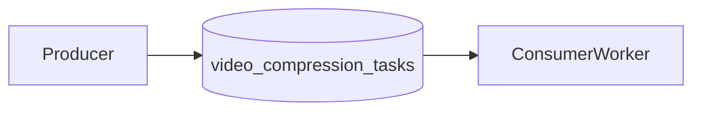

# RabbitMQ Queue Lab

## Overview
This lab demonstrates producer/consumer queue processing with RabbitMQ using
`amqplib` and a simulated video compression workload.

## Architecture


## Prerequisites
- Node.js 18+ and npm
- RabbitMQ running on `amqp://localhost`

## Quick Start
```bash
npm install
node consumer.js
```
In another terminal:
```bash
node producer.js
```

## How to Verify
- Producer sends 10 tasks to queue.
- Consumer prints received tasks and simulated completion lines.

## Failure Scenarios to Try
- Stop consumer and enqueue tasks, then restart consumer to drain queue.
- Uncomment `channel.ack(msg)` and compare queue behavior with/without ack.

## Trade-offs and Design Notes
- Queues decouple request time from work time: producers can enqueue quickly,
  and workers process when capacity is available.
- Acknowledgments (`ack`) are the reliability control. Without them, RabbitMQ
  cannot safely mark work complete, and messages can be redelivered.
- `prefetch(1)` means each worker gets one unacked task at a time, which helps
  prevent one worker from grabbing the whole backlog.

## Observability
- Consumer logs for receive/completion timings.
- RabbitMQ management UI (if enabled) for queue depth and unacked counts.

## Experiments
- **Hypothesis**: `prefetch(1)` balances work among workers.
- **Method**: run multiple consumers and publish burst traffic.
- **Result**: workload distributes more evenly.
- **Interpretation**: flow control settings materially affect throughput/fairness.

## Jargon Explained
- **Durable queue**: queue metadata survives broker restart.
- **Ack (acknowledgment)**: worker confirms task completion to broker.
- **Unacked message**: delivered to worker but not yet confirmed complete.
- **Prefetch**: max in-flight unacked messages assigned to a worker.

## Lessons Learned
- The key practical lesson was that "task received" is not the same as "task
  done." The broker only knows completion when workers ack explicitly.
- I also saw how easy it is to get misleading throughput if ack behavior is
  wrong. Queue depth and unacked counts are better signals than raw logs.
- For beginners, this lab made reliability guarantees tangible: most systems
  choose at-least-once delivery, then make workers idempotent.

## Cleanup
Stop consumer process and RabbitMQ service if local only.

## Further Reading
- RabbitMQ work queues and acknowledgments
