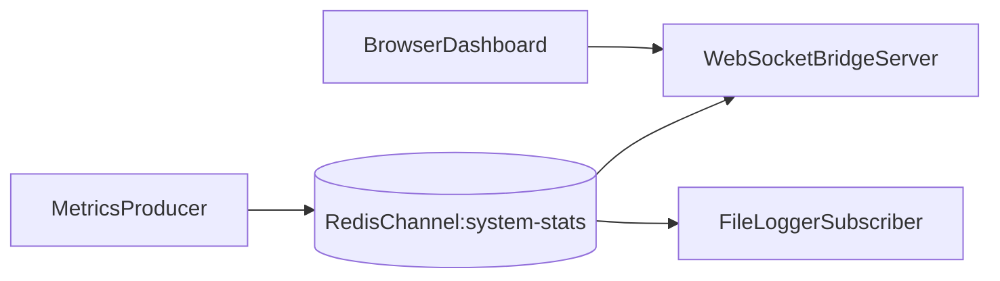

# Redis Monitor Lab

## Overview
This lab streams system metrics through Redis pub/sub and fans out updates to a
WebSocket dashboard and optional file logger subscriber.

## Architecture


## Prerequisites
- Node.js 18+ and npm
- Redis running on `127.0.0.1:6379`

## Quick Start
```bash
npm install
npm run server
```
In another terminal:
```bash
npm run producer
```
Optional logger terminal:
```bash
npm run logger
```
Open dashboard at `http://localhost:3000`.

## How to Verify
- Dashboard should receive live metrics every ~2 seconds.
- Logger should append lines to `system_metrics.log`.

## Failure Scenarios to Try
- Stop Redis and observe server/producer error behavior.
- Run only producer or only server to observe subscriber dependency.

## Trade-offs and Design Notes
- Redis pub/sub is very fast for live fan-out (one publisher, many subscribers)
  because messages are pushed immediately to connected listeners.
- The trade-off is delivery durability: pub/sub is transient. If a subscriber
  disconnects, missed messages are gone unless you add a persistent log/store.
- WebSocket bridging works well for browser dashboards, but it should be paired
  with retention if you need historical charts or replay.

## Observability
- Console logs from producer/server/logger.
- Log growth in `system_metrics.log`.

## Experiments
- **Hypothesis**: pub/sub supports real-time multi-subscriber fan-out.
- **Method**: run dashboard and logger simultaneously.
- **Result**: both receive same channel stream concurrently.
- **Interpretation**: pub/sub is good for transient live updates.

## Jargon Explained
- **Pub/sub**: publish/subscribe messaging model where producers publish to a
  channel and subscribers receive events from that channel.
- **Fan-out**: one message delivered to multiple downstream consumers.
- **Transient stream**: events are not stored for later replay by default.
- **WebSocket bridge**: server component that forwards backend events to browser
  clients over persistent socket connections.

## Lessons Learned
- This lab made one thing obvious: "real-time" and "historical" are different
  requirements. Pub/sub solved real-time nicely, but gave me no replay path.
- The WebSocket bridge pattern felt practical because backend services can stay
  simple while browsers still get push-based updates.
- A useful next step would be dual-write: pub/sub for live updates plus a
  durable stream/table for replay and dashboards over longer windows.

## Cleanup
Stop running node processes. Remove generated log if needed:
```bash
rm -f system_metrics.log
```

## Further Reading
- Redis pub/sub and stream alternatives
